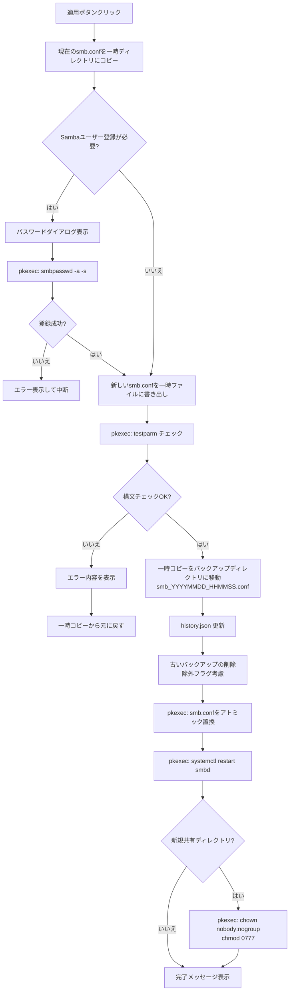

# Samba設定エディター (smb.conf Editor) 実装計画

## 概要

Ubuntu向けのSamba設定ファイル（`/etc/samba/smb.conf`）をGUIで編集するPython+tkinter.ttkアプリケーション。
Sun Valley テーマ（`sv_ttk`）を採用し、モダンなUIを提供する。

## 環境情報

| 項目 | 値 |
|------|-----|
| OS | Ubuntu (Python 3.10.12) |
| smb.conf | `/etc/samba/smb.conf` (242行) |
| 初期設定 | `/usr/share/samba/smb.conf` |
| 必要コマンド | `testparm`, `smbpasswd`, `systemctl`, `pkexec` (全て確認済み) |
| sv_ttk | **未インストール** → `pip install sv_ttk` が必要 |
| 一般ユーザー | `a` (UID 1000) |

## ユーザー確認事項

> [!IMPORTANT]
> 以下の点について確認をお願いします：
> 1. `sv_ttk` を `pip install sv_ttk` でインストールしてよいか
> 2. pkexec用のPolicyKitファイル（`.policy`）を `/usr/share/polkit-1/actions/` に配置する必要があるが、手動インストール手順をREADMEに記載する方針でよいか
> 3. Sambaユーザーの一覧取得には `sudo pdbedit -L` が必要 → ヘルパースクリプト経由で取得する方針でよいか

---

## プロジェクト構成

```
smb-conf-editor/
├── main.py                          # エントリーポイント
├── config.json                      # アプリ設定（自動生成）
├── requirements.txt                 # 依存パッケージ
├── README.md                        # 使い方・インストール手順
├── helpers/
│   ├── smb-helper.sh                # pkexec経由で実行するヘルパースクリプト
│   └── com.github.smb-conf-editor.policy  # PolicyKitポリシーファイル
├── smb_editor/
│   ├── __init__.py
│   ├── app.py                       # メインアプリケーション（Notebook管理）
│   ├── smb_parser.py                # smb.confパーサー（コメント保持）
│   ├── smb_writer.py                # smb.conf書き込み（差分更新）
│   ├── system_utils.py              # システム操作ユーティリティ
│   ├── backup_manager.py            # バックアップ管理
│   ├── apply_manager.py             # 適用処理（*1）の共通ロジック
│   ├── config_manager.py            # アプリ設定の読み書き
│   ├── constants.py                 # 定数定義
│   ├── tabs/
│   │   ├── __init__.py
│   │   ├── shares_tab.py            # 共有フォルダタブ
│   │   ├── global_tab.py            # global設定タブ
│   │   ├── advanced_tab.py          # 詳細設定タブ
│   │   └── history_tab.py           # 過去の設定に戻すタブ
│   └── dialogs/
│       ├── __init__.py
│       ├── log_viewer.py            # ログビューアーダイアログ
│       ├── diff_viewer.py           # 差分表示ダイアログ
│       ├── content_viewer.py        # 内容表示ダイアログ
│       └── password_dialog.py       # Sambaパスワード入力ダイアログ
├── backups/                         # バックアップディレクトリ（自動生成）
│   └── history.json
└── docs/
    └── smb_conf_editor/
        ├── implementation_plan.md
        ├── task.md
        └── walkthrough.md
```

---

## 変更内容（コンポーネント別）

### コアモジュール

---

#### [NEW] [constants.py](file:///home/a/mydata/scripts/Python/smb-conf-editor/smb_editor/constants.py)

アプリ全体で使用する定数を定義:
- `SMB_CONF_PATH = "/etc/samba/smb.conf"`
- `DEFAULT_SMB_CONF = "/usr/share/samba/smb.conf"`
- `DEFAULT_LOG_DIR = "/var/log/samba"`
- `DEFAULT_EDITOR = "gedit"`
- `DEFAULT_BACKUP_DIR = "./backups"`
- `DEFAULT_MAX_BACKUPS = 5`
- `SYSTEM_SECTIONS = {"printers", "print$", "homes", "netlogon", "profiles"}` （共有フォルダ一覧に表示しないセクション）
- 新規共有フォルダのテンプレート辞書

---

#### [NEW] [config_manager.py](file:///home/a/mydata/scripts/Python/smb-conf-editor/smb_editor/config_manager.py)

アプリ設定（`config.json`）の読み書き:
```python
# デフォルト設定
{
    "editor": "gedit",
    "backup_dir": "./backups",
    "max_backups": 5,
    "default_smb_conf": "/usr/share/samba/smb.conf",
    "log_dir": "/var/log/samba",
    "theme": "dark"
}
```

---

#### [NEW] [smb_parser.py](file:///home/a/mydata/scripts/Python/smb-conf-editor/smb_editor/smb_parser.py)

smb.confのパーサー。**コメントと構造を完全に保持**する設計:

```python
@dataclass
class SmbLine:
    """smb.confの1行を表す"""
    raw: str              # 元の行テキスト
    line_type: str        # 'comment' | 'blank' | 'section' | 'param' | 'commented_param'
    key: str = ""         # パラメータ名（小文字正規化）
    value: str = ""       # パラメータ値
    section: str = ""     # セクション名（[xxx]の場合）

@dataclass
class SmbSection:
    """smb.confの1セクション"""
    name: str                    # セクション名
    lines: list[SmbLine]         # セクション内の全行（コメント含む）
    start_line: int              # ファイル内の開始行番号
    end_line: int                # ファイル内の終了行番号

class SmbConfParser:
    def parse(self, filepath: str) -> SmbConfig
    def get_global_params(self) -> dict
    def get_share_sections(self) -> list[SmbSection]  # システムセクション除外
    def get_section(self, name: str) -> SmbSection | None
    def get_param(self, section: str, key: str) -> str | None
```

**パース戦略**:
1. ファイルを行ごとに読み込み、各行を `SmbLine` としてパース
2. `[section]` ヘッダーを検出してセクション分割
3. `#` / `;` で始まる行はコメントとして保持
4. パラメータ行は `key = value` 形式をパース（`=` の前後スペースを許容）

---

#### [NEW] [smb_writer.py](file:///home/a/mydata/scripts/Python/smb-conf-editor/smb_editor/smb_writer.py)

smb.confへの書き込み。**変更箇所のみ更新**する設計:

```python
class SmbConfWriter:
    def update_param(self, section: str, key: str, value: str)
    def remove_param(self, section: str, key: str)
    def add_section(self, name: str, params: dict)
    def remove_section(self, name: str)
    def write_to_file(self, filepath: str)  # 一時ファイルに書き出し
```

**書き込み戦略**:
- 既存セクションのパラメータ変更: 該当行を直接置換
- 既存セクションにパラメータ追加: セクション末尾に追加
- パラメータ削除: 該当行を削除
- セクション追加: ファイル末尾に追加
- セクション削除: セクション全体を削除（前後のコメントブロックは保持するか確認ダイアログ）

---

#### [NEW] [system_utils.py](file:///home/a/mydata/scripts/Python/smb-conf-editor/smb_editor/system_utils.py)

システム情報の取得:
- `get_system_users()` → `/etc/passwd` からUID≧1000のユーザー一覧
- `get_samba_users()` → ヘルパースクリプト経由で `pdbedit -L` 実行
- `get_network_address()` → `ip addr show` からネットワークアドレスを計算
- `check_command_exists(cmd)` → `shutil.which()` でコマンド存在確認
- `check_samba_installed()` → Sambaインストール確認
- `get_log_files(log_dir)` → ログディレクトリ内のファイル一覧

---

#### [NEW] [backup_manager.py](file:///home/a/mydata/scripts/Python/smb-conf-editor/smb_editor/backup_manager.py)

バックアップの管理:

```python
class BackupManager:
    def create_backup(self, category: str, comment: str = "") -> str
    def restore_backup(self, filename: str)
    def delete_old_backups(self)  # max_backupsを超えた古いものを削除（除外フラグ考慮）
    def get_backup_list(self) -> list[BackupEntry]
    def update_comment(self, filename: str, comment: str)
    def set_exclude(self, filename: str, exclude: bool)
    def get_diff(self, backup_file: str, current_file: str) -> str
    def read_backup(self, filename: str) -> str
```

**history.json の構造**:
```json
{
  "backups": [
    {
      "filename": "smb_20261020_113204.conf",
      "timestamp": "2026-10-20T11:32:04",
      "comment": "",
      "exclude_from_deletion": false,
      "category": "shared_folder"
    }
  ]
}
```

---

#### [NEW] [apply_manager.py](file:///home/a/mydata/scripts/Python/smb-conf-editor/smb_editor/apply_manager.py)

「適用」処理（`*1`）の共通ロジック:

```python
class ApplyManager:
    def apply_changes(self, new_conf_content: str, category: str,
                      comment: str = "", samba_users_to_add: list = None,
                      new_share_dirs: list = None) -> ApplyResult:
        """
        適用処理の全ステップを実行:
        1. 現在のsmb.confをバックアップ用に一時コピー
        2. Sambaユーザー登録（必要な場合）
        3. 新しいsmb.confを一時ファイルに書き出し
        4. testparmで構文チェック
        5. チェックOK → バックアップ作成 → smb.confをアトミック置換 → smbd再起動
        6. チェックNG → エラー表示 → 元に戻す
        7. 新規共有ディレクトリの所有者(nobody:nogroup)・パーミッション(0777)設定
        """
```

全ての処理はヘルパースクリプト経由で `pkexec` を使って実行する。

---

### ヘルパースクリプト

---

#### [NEW] [smb-helper.sh](file:///home/a/mydata/scripts/Python/smb-conf-editor/helpers/smb-helper.sh)

pkexec経由で実行するroot権限ヘルパー。サブコマンド方式:

```bash
#!/bin/bash
# 使い方: pkexec /path/to/smb-helper.sh <command> [args...]

case "$1" in
    copy-conf)        # smb.confを指定先にコピー
    write-conf)       # 一時ファイルからsmb.confへアトミック置換
    test-conf)        # testparm実行
    restart-smbd)     # systemctl restart smbd
    add-samba-user)   # smbpasswd -a -s username (stdinからパスワード読み取り)
    list-samba-users) # pdbedit -L
    set-permissions)  # chown + chmod
    restore-conf)     # バックアップファイルからsmb.confを復元
    backup-conf)      # smb.confをバックアップディレクトリにコピー
esac
```

---

#### [NEW] [com.github.smb-conf-editor.policy](file:///home/a/mydata/scripts/Python/smb-conf-editor/helpers/com.github.smb-conf-editor.policy)

PolicyKitポリシーファイル。ヘルパースクリプトの実行を許可する設定。

---

### UIタブ

---

#### [NEW] [app.py](file:///home/a/mydata/scripts/Python/smb-conf-editor/smb_editor/app.py)

メインアプリケーション:
- `sv_ttk` ダークテーマの初期化
- `ttk.Notebook` による4タブ構成
- 初回起動チェック（Samba、smb.conf、必要コマンド）
- smb.conf のパースと各タブへのデータ配信
- ウィンドウサイズ: 900x700（目安）

---

#### [NEW] [shares_tab.py](file:///home/a/mydata/scripts/Python/smb-conf-editor/smb_editor/tabs/shares_tab.py)

共有フォルダタブ:
- スクロール可能なフレーム内に共有フォルダカードを縦に並べる
- 各カードの構成:
  - 表示名（Entry）、ディレクトリパス（Entry）、[閲覧]ボタン、☐読み込みのみ（Checkbutton）
  - アクセス許可セクション: ☐ゲスト、各ユーザーのCheckbutton（Sambaユーザーにはアイコン付き）
  - [削除]ボタン（確認ダイアログ付き）
- 最下部に空の「新規共有フォルダ」カード
- 最上部に[適用]ボタン
- ゲストチェック時: ユーザーチェックボックスをグレーアウト（`state=['disabled']`）

---

#### [NEW] [global_tab.py](file:///home/a/mydata/scripts/Python/smb-conf-editor/smb_editor/tabs/global_tab.py)

global設定タブ:
- workgroup（Entry）
- hosts allow（テキストエリア、改行区切り）+ [自動入力]ボタン
- 折りたたみ可能な「その他の設定」セクション:
  - server string、log level、max log size、server min protocol
- [適用]ボタン
- hosts allow のIPアドレスバリデーション

---

#### [NEW] [advanced_tab.py](file:///home/a/mydata/scripts/Python/smb-conf-editor/smb_editor/tabs/advanced_tab.py)

詳細設定タブ:
- エディター指定（Entry）+ [存在確認]ボタン + [直接編集]ボタン
- ログファイルセクション:
  - ログディレクトリ（Entry）+ [閲覧]ボタン
  - ログファイル一覧（動的生成）+ 各ファイルに[内容表示]ボタン

---

#### [NEW] [history_tab.py](file:///home/a/mydata/scripts/Python/smb-conf-editor/smb_editor/tabs/history_tab.py)

過去の設定に戻すタブ:
- 初期設定ファイルパス（Entry）+ [閲覧]ボタン
- バックアップディレクトリ（Entry）+ [閲覧]ボタン
- バックアップ最大数（Spinbox）
- バックアップ一覧（スクロール可能）:
  - 各エントリ: 日時、コメント（Entry）、☐削除対象から除外、[内容表示]、[差分表示]、[この設定に戻す]

---

### ダイアログ

---

#### [NEW] [log_viewer.py](file:///home/a/mydata/scripts/Python/smb-conf-editor/smb_editor/dialogs/log_viewer.py)

ログビューアー:
- 末尾100行表示 + [全文表示]ボタン
- テキスト検索機能（Ctrl+F）
- 自動更新トグル（`after()` で定期的に `tail` 実行）

---

#### [NEW] [diff_viewer.py](file:///home/a/mydata/scripts/Python/smb-conf-editor/smb_editor/dialogs/diff_viewer.py)

差分表示:
- `difflib.unified_diff()` を使用
- `Text` ウィジェットでタグによるカラー表示:
  - 追加行: 緑背景
  - 削除行: 赤背景
  - ヘッダー: 青文字

---

#### [NEW] [content_viewer.py](file:///home/a/mydata/scripts/Python/smb-conf-editor/smb_editor/dialogs/content_viewer.py)

内容表示ダイアログ:
- 読み取り専用の `Text` ウィジェット
- テキスト検索機能

---

#### [NEW] [password_dialog.py](file:///home/a/mydata/scripts/Python/smb-conf-editor/smb_editor/dialogs/password_dialog.py)

Sambaパスワード入力ダイアログ:
- パスワード入力（`show='*'`）
- パスワード確認入力
- 一致チェック

---

## 適用処理（*1）フロー図



---

## 検証計画

### 自動テスト
- `smb_parser.py` のユニットテスト: 実際の smb.conf をパースし、セクション・パラメータが正しく取得できるか
- `smb_writer.py` のユニットテスト: パラメータ追加/変更/削除が正しく行われるか
- `backup_manager.py` のユニットテスト: バックアップの作成/削除/履歴管理
- IPアドレスバリデーションのテスト

### 手動検証
- GUIの動作確認（各タブの表示・操作）
- 実際の smb.conf に対する読み書きテスト（テスト用コピーで実施）
- pkexec経由のヘルパースクリプト実行テスト
- バックアップ/リストアのフルフローテスト

---

## 実装順序

1. **Phase 1**: コア基盤（constants, config_manager, smb_parser, smb_writer）
2. **Phase 2**: システムユーティリティ（system_utils, backup_manager）
3. **Phase 3**: ヘルパースクリプト（smb-helper.sh, PolicyKitポリシー）
4. **Phase 4**: 適用処理（apply_manager）
5. **Phase 5**: メインアプリとUI（app.py, 4タブ）
6. **Phase 6**: ダイアログ（log_viewer, diff_viewer, content_viewer, password_dialog）
7. **Phase 7**: テスト・検証・ドキュメント

## オープンクエスチョン

> [!IMPORTANT]
> 1. `sv_ttk` を `pip install sv_ttk` でインストールしてよいか？
> 2. PolicyKitファイルの配置は手動インストール手順をREADMEに記載する方針でよいか？
> 3. Sambaユーザー一覧の取得をヘルパースクリプト経由にする方針でよいか？
